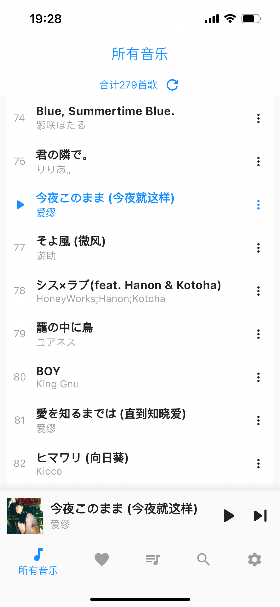
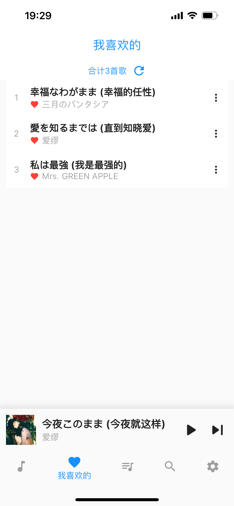
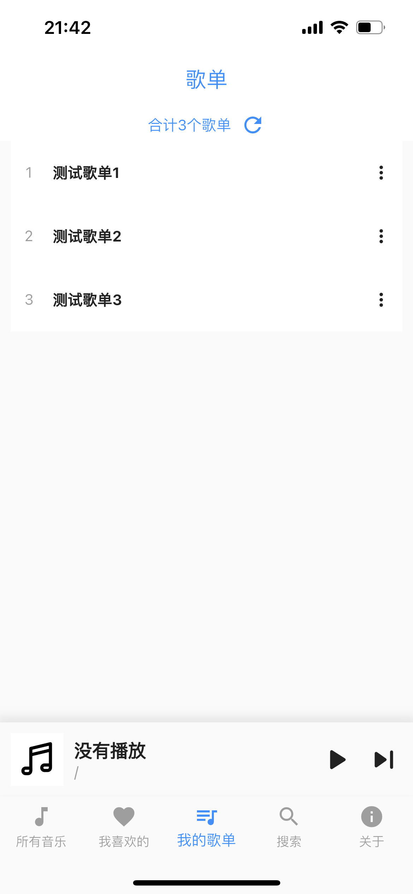
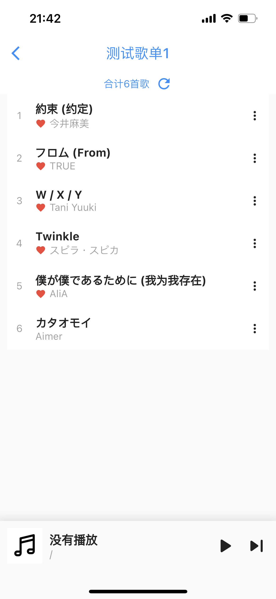
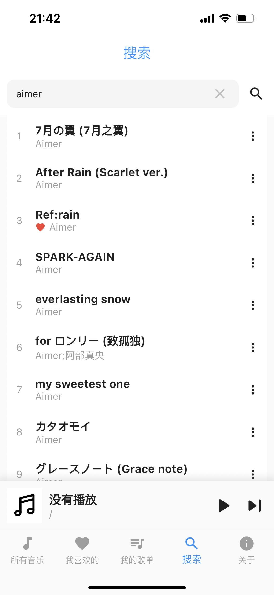
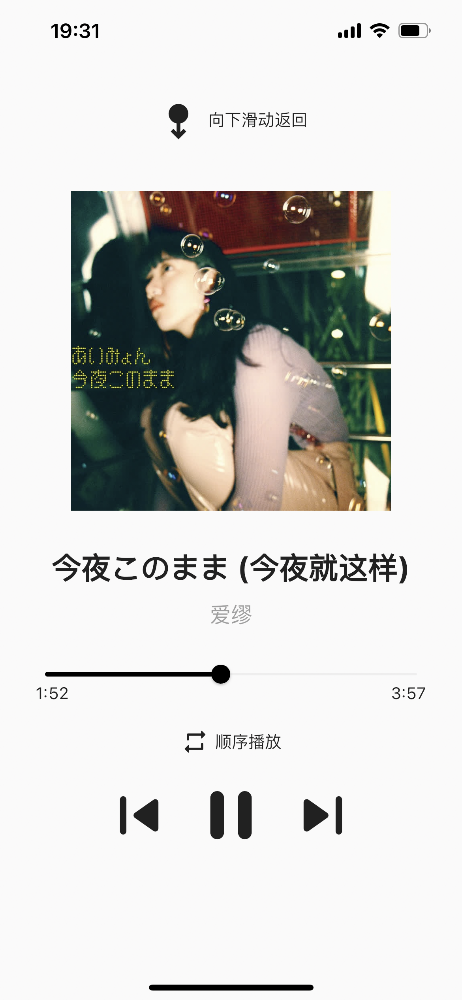

# netPlayer Mobile

**基于Subsonic API的移动端播放器**

**支持Android设备和iOS设备**

（`apk`安装包见`Release`，iOS设备请自行下载源码安装）

关于桌面版的netPlayer，你可以在这里查看：[Gitee](https://gitee.com/Ryan-zhou/net-player) / [Github](https://github.com/Zhoucheng133/net-player)  
关于移动Lite的netPlayer，你可以在这里查看：[Gitee](https://gitee.com/Ryan-zhou/net-player_-lite) / [Github](https://github.com/Zhoucheng133/neyPlayer_Lite)  
关于PWA版本的netPlayer，你可以在这里查看：[Gitee](https://gitee.com/Ryan-zhou/net-player-pwa) / [Github](https://github.com/Zhoucheng133/netPlayer-PWA)

|                          | netPlayer                       | netPlayer Mobile                                             | netPlayer Lite                                               | netPlayer PWA         |
| ------------------------ | ------------------------------- | ------------------------------------------------------------ | ------------------------------------------------------------ | --------------------- |
| 兼容系统                 | Windows macOS Linux ⭕ | iOS Android Web (PWA) 1 Windows❗ macOS❗ Linux❗ | iOS Android Web (PWA) ⭕ Windows❗ macOS❗ Linux❗ | Web (PWA)1 |
| 基于                     | Vue & Electron                  | Flutter                                                      | Flutter                                                      | Vue                   |
| 登录                     | ✅                               | ✅                                                            | ✳️                                                            | ✅                     |
| 通过系统控制1 | ✅                               | ✅                                                            | ✅                                                            | ✅                     |
| 查看所有歌曲             | ✅                               | ✅                                                            | ❌                                                            | ✅                     |
| 查看歌单                 | ✅                               | ✅                                                            | ❌                                                            | ✅                     |
| 查看喜欢的歌曲           | ✅                               | ✅                                                            | ❌                                                            | ✅                     |
| 搜索                     | ✅                               | ✅                                                            | ❌                                                            | ✅                     |
| 播放顺序                 | 顺序/随机                       | 顺序/随机                                                    | 随机                                                         | 顺序/随机             |
| 添加到喜欢               | ✅                               | ✅                                                            | ❌                                                            | ✅                     |
| 添加到歌单               | ✅                               | ✅                                                            | ❌                                                            | ✅                     |
| 删除歌单                 | ✅                               | ✅                                                            | ❌                                                            | 放弃开发              |
| 编辑歌单                 | ✅                               | ✅                                                            | ❌                                                            | ❌                     |

⭕：理论上支持，但是没有做测试  
❗：理论上支持，但是不推荐在该平台上运行

✅：支持  
❌：不支持  
✳️：有限的支持

1：对于所有需要运行在iOS设备上的PWA应用程序，**可能**因为苹果的后台管理政策无法实现自动播放下一首和系统控制功能，如果你希望在iOS设备上正确的工作，可以使用纯Web模式使用浏览器打开

**相对于Mobile版本，PWA版本在iOS平台以PWA方式安装的时候如果放在前台可以自动切换下一首**

## 截图

## 更新日志

### v1.1.1 (iOS & Android & PWA) (开发中)
- 修复登录时输入框遮挡问题
- 添加请求超时的提示

### v1.1.0 (iOS & Android & PWA) (2023/10/20)
- 添加了新建歌单的功能
- 修改了没有及时刷新的bug
- 重构了获取版本号的逻辑
- 改进软键盘输入的交互

### v1.0.2 (iOS & Android & PWA) (2023/10/12)
- 取消了底部栏上层阴影
- 添加了对Web和PWA的支持
- 解决了在PWA环境中标题栏的一些问题
- 使用just audio库代替audio players

### v1.0.1 (iOS & Android) (2023/10/10)
- 添加对安卓设备的支持
- 修复一些问题
- 在Android设备上使用Material弹窗
- 修复弹窗文本错误

### ~~v1.0.1 (2023/10/10)~~
- ~~添加对安卓版本的支持~~
- ~~修复一些问题~~

### v1.0.0 (iOS)
- 第一个版本