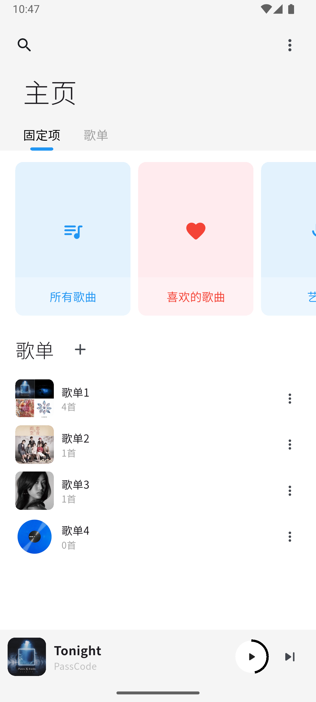
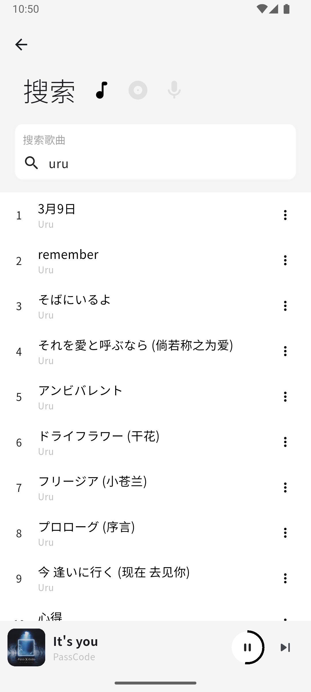

# netPlayer Mobile

**基于Subsonic API的移动端播放器**

[**netPlayer Next**](https://github.com/Zhoucheng133/netPlayer-Next) | [**netPlayer**](https://github.com/Zhoucheng133/net-player) | **★ netPlayer Mobile**

**支持Android设备和iOS设备**

经过测试的平台：小米5X

（`apk`安装包见`Release`，iOS设备请自行下载源码安装）

**受限于Subsonic API，“所有歌曲”和“专辑”只能显示500首/张（随机的500首歌曲排序展示），如果你要随机播放所有的歌曲，可以点击主页右上角更多-随机播放所有歌曲**

**如果你已经安装了v1.x版本的netPlayer Mobile，那么请在升级到v2.0.0或更新版本时卸载旧版本**

## 一些使用技巧

- 在主页-更多(位于右上角三个点)中可以选择随机播放所有歌曲，这种方式随机播放的歌曲**不受**API中500首歌曲的限制
- 在播放页面可以点击封面来查看歌词，同理点击歌词可以隐藏歌词

## 在你的设备上配置netPlayer Mobile

### 环境配置

- 如果你需要在Android设备上运行或者调试，需要安装Android Studio和Gradle
- 如果你需要在iOS设备上运行或者调试，需要使用Mac，并且安装Xcode*
- 安装Flutter，安装步骤见[Flutter - 开始使用](https://flutter.cn/docs/get-started/install)，本项目使用的Flutter版本为`3.22`
- 建议使用Visual Studio Code打开项目
  - 在Visual Studio Code的右下角找到`Device`按钮（也有可能显示为可用的设备），选择目标设备或者模拟器
  - 在`运行和调试`面板选择`Debug`，`Profile`或者`Release`**，详细的区别见[Flutter官网](https://docs.flutter.dev/testing/build-modes)

*注意，你需要通过Xcode（使用Xcode打开文件`ios/Runner.xcworkspace`可以自动获取）获取证书，非开发者账户的证书的有效期为一个星期，也就是说一个星期之后你需要重新打开Xcode获取证书

**注意，模拟器无法使用`Release`模式，实体iPhone无法使用`Debug`模式

## 截图

以下截图运行在模拟机上，不同设备上运行效果可能略有不同

## 更新日志

### 2.0.3
- 添加从网易云音乐获取歌词
- 修复打开的第一首歌没有歌词的问题

过往的版本

### 2.0.2 (2024/8/28)
- 添加清理缓存的功能
- 添加更新音乐库的功能
- 改进交互的反馈
- 禁用设备横屏幕显示
- 修复注销后重新打开app仍处于登录状态的问题

### 2.0.1 (2024/8/26)
- 大幅改进滚动区域滚动效率
- 改进登录界面UI和文本框
- 改进一些过渡动画
- 现在支持搜索歌曲的同时也可以搜索艺人和专辑
- 修复定位按钮不可用的问题
- 此版本可以正常支持搜索功能

### 2.0.0 (Beta) (2024/8/25)
- 重构了所有界面
- 添加歌单缩略图
- 添加更新音乐库后自动重新排序
- 改进了歌词显示的效果
- 改进拖动时间轴的响应
- 提升运行效率和网络请求效率
- ❌**当前版本**没有搜索功能，仍在开发中
- ⚠️这是一个Beta版本，可能会有一些问题

### 1.6.4 (iOS & Android) (2024/7/3)
- 大幅缩小了app体积
- 修复了导航条可能会黑底的问题
- 改进了字体显示
- 改进登录界面交互
- 改进了搜索界面
- 改进了一些UI反馈
- 修改了app id （如果你从旧版本更新，可能需要卸载老版本）

### 1.6.3 (iOS & Android, 仅Android的更新) (2024/5/13)
- 修复新版本Android系统无法使用http连接的问题
- 添加一些用于开发的镜像地址

### 1.6.2 (iOS & Android) (2024/4/3)
- 修复更新歌曲没有更新歌曲定位的问题
- 修复提示错误

### 1.6.1 (iOS & Android) (2024/3/19)
- 添加记住播放顺序的功能
- 添加外部中断播放时自动识别的功能

### 1.6.0 (iOS & Android) (2024/3/16)
- 添加在播放界面查看歌曲信息
- 添加在播放界面将歌曲添加到歌单
- 改进播放界面布局
- 改进了字体显示
- 改进歌曲统计显示和操作按钮布局
- 修复歌词滚动的上下间距问题
- 修复16:9设备在播放界面的显示问题
- 清理了一些冗余代码

### 1.5.4 (iOS & Android) (2024/3/11)
- 添加清理歌曲封面图片缓存的功能
- 修复安卓设备导航条黑色背景的问题 ([#2](https://github.com/Zhoucheng133/netPlayer-Mobile/issues/2))

### 1.5.3 (iOS & Android) (2024/3/8)
- 本地化一些系统控件的语言
- 修复后台滚动歌词的问题
- 修复搜索框对齐的问题

### 1.5.2 (iOS & Android) (2024/3/4)
- 修复搜索框无法离开焦点的问题

### 1.5.1 (iOS & Android) (2024/3/1)
- 添加使用菜单来选择播放模式
- 添加了单曲循环模式
- 修复退出完全随机播放崩溃的问题
- 修复显示歌词时退出播放界面的动画问题

### 1.5.0 (iOS & Android) (2024/2/16)
- 使用Material风格的底部栏
- 改进跳转到播放位置的效果
- 改进AppBar
- 修复从随机播放模式退出之后无法打开App的问题

### 1.4.0 (iOS & Android) (2024/1/24)
- 添加显示歌词功能
- 稍微增长了网络请求超时的时间
- 修复Android设备AppBar显示问题

### 1.3.4 (iOS & Android) (2024/1/1)
- 添加定位到当前播放歌曲的功能

### 1.3.3 (iOS & Android) (2023/12/5)
- 添加所有歌曲≥500首歌曲的提示

### v1.3.2 (iOS & Android) (2023/11/27)
- 播放页添加star/unstar操作
- 添加打开App的启动页面

### v1.3.1 (iOS & Android) (2023/11/10)
- 添加完全随机播放
- 修改加载上次播放信息的问题

### v1.3.0 (iOS & Android) (2023/10/31)
- 添加设置选项卡
- 自定义是否自动保存播放信息
- 自定义是否自动登录
- 改进刷新歌单逻辑
- 改进了参数传递的效率
- 改进了一些图标显示效果
- 改进播放界面布局
- 修复搜索时输入框为空时的错误
- 修复了歌单内容刷新没有刷新喜欢歌曲的问题

### v1.2.0 (iOS & Android & PWA) (2023/10/27)
- 添加播放进度条
- 添加播放进度条的跳转功能
- 支持在设备控制中心跳转功能
- 提高页面跳转性能
- 修复重新请求出现错误的问题
- 修复页面滚动问题
- 修复暂停播放进度条错误的问题

### v1.1.1 (iOS & Android & PWA) (2023/10/24)
- 修复登录时输入框遮挡问题
- 添加请求超时的提示

### v1.1.0 (iOS & Android & PWA) (2023/10/20)
- 添加了新建歌单的功能
- 修改了没有及时刷新的bug
- 重构了获取版本号的逻辑
- 改进软键盘输入的交互

### v1.0.2 (iOS & Android & PWA) (2023/10/12)
- 取消了底部栏上层阴影
- 添加了对Web和PWA的支持
- 解决了在PWA环境中标题栏的一些问题
- 使用just audio库代替audio players

### v1.0.1 (iOS & Android) (2023/10/10)
- 添加对安卓设备的支持
- 修复一些问题
- 在Android设备上使用Material弹窗
- 修复弹窗文本错误

### ~~v1.0.1 (2023/10/10)~~
- ~~添加对安卓版本的支持~~
- ~~修复一些问题~~

### v1.0.0 (iOS)
- 第一个版本

## Subsonic API

[关于所有的API点此](http://www.subsonic.org/pages/api.jsp)

## 歌词API

[关于歌词的API点此](https://lrclib.net/docs)
