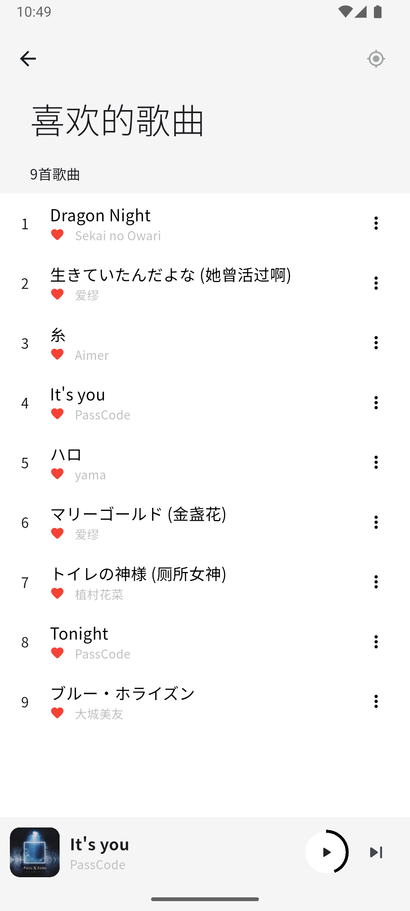

# netPlayer Mobile

**基于Subsonic API的移动端播放器**

**NOT** support multi-language yet. But you can still view the English version of the README [HERE](./document/en.md)

[**netPlayer Next**](https://github.com/Zhoucheng133/netPlayer-Next) | **★ netPlayer Mobile**

**支持Android设备和iOS设备**，如果你要查找桌面版本，应该访问[**netPlayer Next**](https://github.com/Zhoucheng133/netPlayer-Next)仓库

经过测试的平台：小米5X & iPhone13  
若有任何bug欢迎提交至Issues

（`apk`安装包见`Release`，iOS设备请自行下载源码安装）

> [!TIP]
> 受限于Subsonic API，“所有歌曲”和“专辑”只能显示500首/张（随机的500首歌曲排序展示）  
> 从`v2.3.0`版本开始支持显示Navidrome服务的“所有歌曲”和“专辑”（默认开启，优先检查是否支持Navidrome API）

## 一些使用技巧

> [!TIP]
> 在主页-更多(位于右上角三个点)中可以选择随机播放所有歌曲，这种方式随机播放的歌曲**不受**API中500首歌曲的限制

> [!TIP]
> 在播放页面可以点击封面来查看歌词，同理点击歌词可以隐藏歌词

## 截图

以下截图运行在模拟机上，不同设备上运行效果可能略有不同

## 常见问题

### 无法连接到音乐服务器:

> 你需要先检查你的客户端设备是否可以直接打开音乐库网页，很大概率是服务器防火墙或者设置问题  
> 另外务必检查地址，http和https

### 没有找到歌词:

> 歌词API见文末，没有找到歌词就是字面意思
> 歌词的内容取决于歌曲标题、所属专辑、艺人和歌曲长度

### 没有封面 (或者是默认封面):

> 歌曲的封面来自你上传的音频文件，如果音频文件没有内嵌封面则会显示默认封面  
> 另外经过测试部分编码的音频文件内嵌封面加载存在异常（或加载时间过长），可能会导致崩溃，因此也会显示默认封面

## 在你的设备上配置netPlayer Mobile

### 环境配置

- 如果你需要在Android设备上运行或者调试，需要安装Android Studio
  - 项目使用的Gradle版本为: `8.4` (会自动下载)
  - 开发使用的Android SDK版本: `35.0.1`
- 如果你需要在iOS设备上运行或者调试，需要使用Mac，并且安装Xcode*
  - Minimum Deployment Target: `iOS 12.0`
- 安装Flutter，安装步骤见[Flutter - Quick start](https://docs.flutter.cn/get-started/quick)，本项目使用的Flutter版本为`3.32`
- 建议使用Visual Studio Code打开项目
  - 在Visual Studio Code的右下角找到`Device`按钮（也有可能显示为可用的设备），选择目标设备或者模拟器
  - 在`运行和调试`面板选择`Debug`，`Profile`或者`Release`**，详细的区别见[Flutter官网](https://docs.flutter.dev/testing/build-modes)

*注意，你需要通过Xcode（使用Xcode打开文件`ios/Runner.xcworkspace`可以自动获取）获取证书，非开发者账户的证书的有效期为一个星期，也就是说一个星期之后你需要重新打开Xcode获取证书

**注意，模拟器无法使用`Release`模式，实体iPhone无法使用`Debug`模式

## 一些API

[Subsonic API](http://www.subsonic.org/pages/api.jsp)

[lrclib API](https://lrclib.net/docs)

网易云音乐