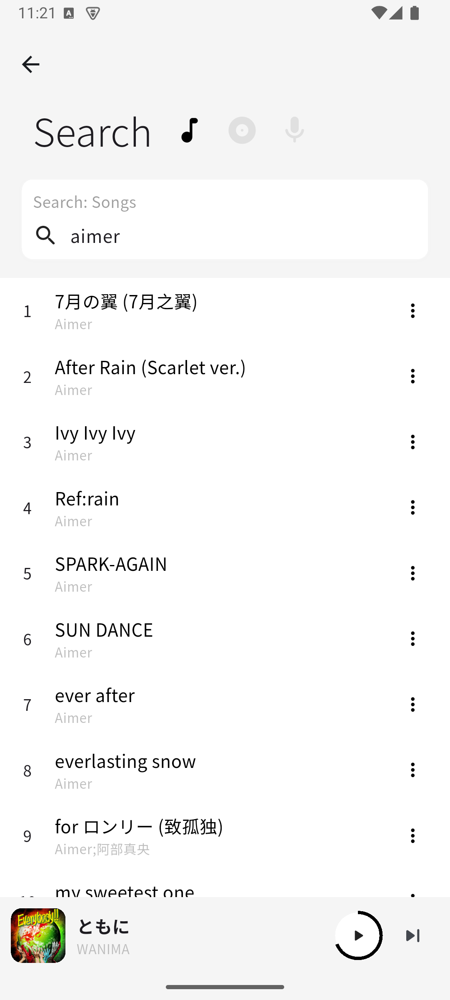
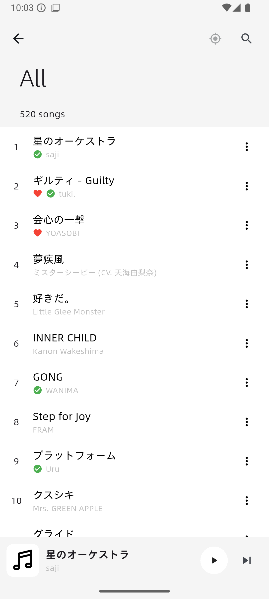
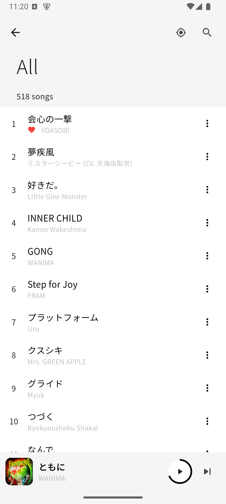
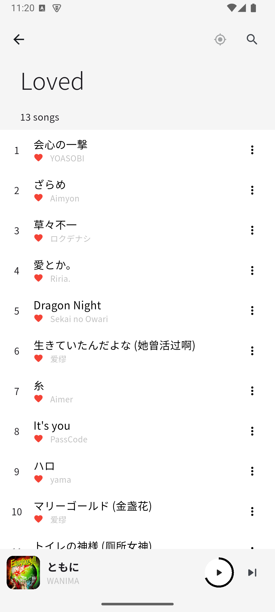
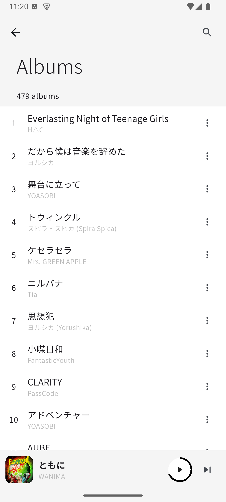
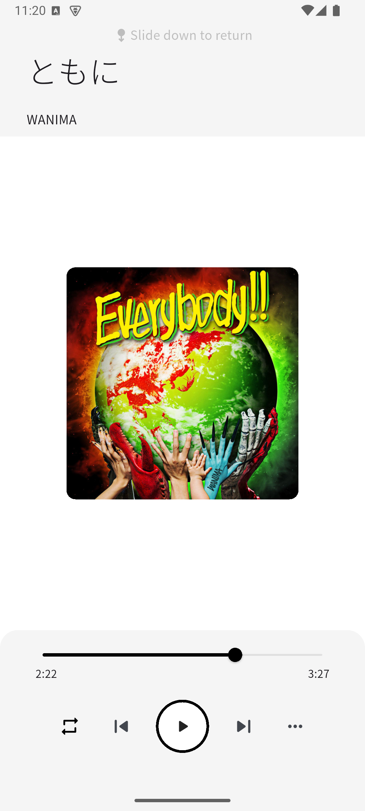
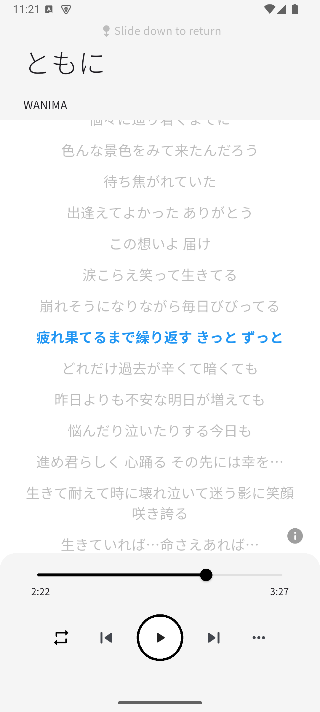

# netPlayer Mobile

## Intro

**A mobile music player based on the Subsonic API**

[**netPlayer Next**](https://github.com/Zhoucheng133/netPlayer-Next) | **★ netPlayer Mobile**

**Supports both Android and iOS devices.**  
If you are looking for the desktop version, please visit the [**netPlayer Next**](https://github.com/Zhoucheng133/netPlayer-Next) repository.

Tested on: Xiaomi 5X & iPhone 13  
If you encounter any bugs, feel free to report them in the Issues section.

(`apk` installers can be found in **Releases**. For iOS devices, please download and build from source.)

> [!TIP]
> Due to limitations of the Subsonic API, “All Songs” and “Albums” can only display 500 items  (a random selection of 500 songs).  
> Starting from `v2.3.0`, Navidrome's “All Songs” and “Albums” are supported  (enabled by default, and the app will first check whether the Navidrome API is available).

## Tips & Tricks

> [!TIP]
> On the Home page → More (top-right three dots), you can shuffle **all** songs.  
> This shuffle mode is **not** limited by the 500-song restriction in the API.

> [!TIP]
> On the playback page, tap the album cover to show lyrics.  
> Tap the lyrics again to hide them.

## Screenshots

The following screenshots were taken on emulators. The actual appearance may vary by device.

## Supported Languages

- English
- Simplified Chinese
- Traditional Chinese

## FAQ

### Unable to connect to the music server

> First check whether your device can directly open the music library's web page.  
> In most cases the issue is caused by server configuration or firewall rules.  
> Also double-check the URL (both http and https).

### Lyrics not found

> The lyrics API is listed below.  
> “Not found” simply means no matching lyrics were available.  
> Results depend on the song title, album, artist, and track duration.

### No album art (or default cover appears)

> Album art comes from the embedded image inside your audio files.  
> If a file does not contain embedded cover art, the default image will be shown.  
>  
> Some audio encodings have issues loading embedded images (slow loading or failures),  
> which may cause crashes, so the app will fall back to showing the default cover.

## Setting up netPlayer Mobile on your device

### Environment Requirements

- For Android development or debugging: install **Android Studio**
  - Gradle version required: `8.4` (Download automatically)
  - My development environment: Android SDK `35.0.1`
  - Specify NDK version: `27.2.12479018`
- For iOS development or debugging: you must use **macOS** and install **Xcode***
  - Minimum Deployment Target: `iOS 12.0`
- Install **Flutter** — see the official guide:  
  [Flutter - Quick Start](https://docs.flutter.cn/get-started/quick)  
  This project uses **Flutter 3.32**
- It is recommended to open the project with **Visual Studio Code**
  - In the bottom-right corner of VS Code, find the **Device** selector and choose a device or emulator
  - In the **Run and Debug** panel, select `Debug`, `Profile`, or `Release`**  
    (See the Flutter docs for differences: https://docs.flutter.dev/testing/build-modes)

*Note: You must obtain a signing certificate through Xcode  
(open `ios/Runner.xcworkspace` using Xcode to generate it automatically).  
Certificates for non-developer Apple accounts are valid for **one week**,  
after which you must re-open Xcode to renew them.

**Note:  
- Emulators cannot run in `Release` mode  
- Physical iPhones cannot run in `Debug` mode

## APIs

- [Subsonic API](http://www.subsonic.org/pages/api.jsp)
- [lrclib API](https://lrclib.net/docs)
- Netease Cloud Music